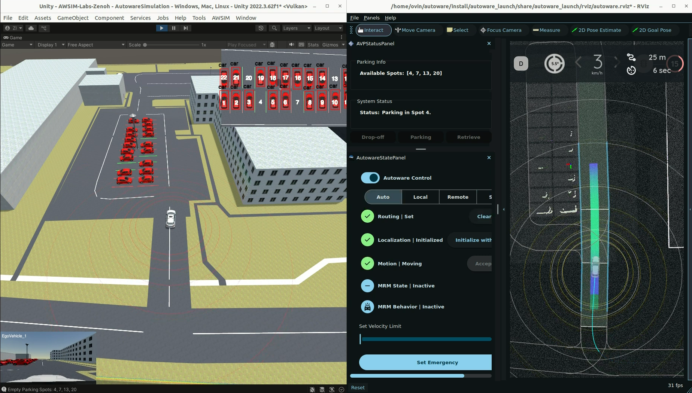

# Autonomous Valet Parking Framework
*A Simulation Framework for Perception-to-Parking Automation*

The **Autonomous Valet Parking Framework** integrates **Autoware**, **AWSIM Labs**, and **YOLOv5-based parking spot detection** into a unified simulation flow — from perception to autonomous parking.  

It enables a complete valet parking experience inside simulation, with automated parking spot detection, goal assignment, and route execution.

---

## Demo 

---

## Features
- YOLOv5-based top-down parking spot detection
- Integration with Autoware’s planning and control stack
- Unity-based bounding box visualization
- Support for custom maps and parking layouts
- Ubuntu 22.04 (ROS 2 Humble) compatibility

---

## Getting Started and Documentation

[https://zubxxr.github.io/autonomous-valet-parking](https://zubxxr.github.io/autonomous-valet-parking)

---
